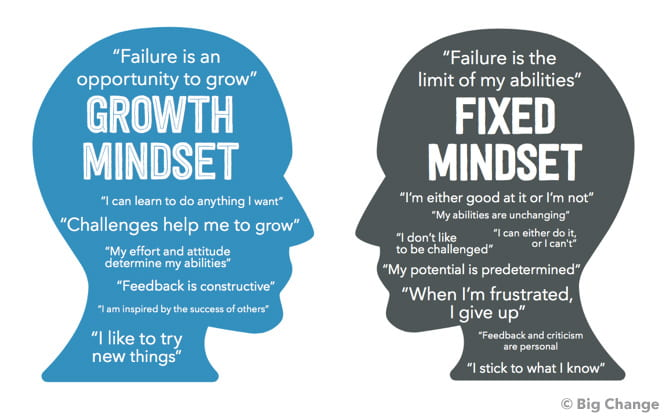

******

    The growth mindset is a fundamental concept in the field of computer science, as it can significantly influence the success of programmers. Programming is a constantly evolving and complex domain that requires continuous learning and adaptation. Individuals with a fixed mindset may struggle to keep up with the demands of programming, as they may be unwilling to take risks and embrace new challenges.

Studies have demonstrated that cultivating a growth mindset is **critical for achieving success** in programming. Researchers have explored various avenues for promoting and developing a growth mindset in programmers, including examining the impact of feedback and praise on mindset, evaluating the effectiveness of mindset interventions on academic performance, and identifying strategies for fostering a growth mindset in different settings, such as academic institutions and workplaces.

    Adopting a growth mindset can have far-reaching benefits for programmers, beyond just enhancing their abilities in programming. By embracing challenges, persisting through obstacles, and learning from their mistakes, programmers can improve their problem-solving skills, become more resilient, and ultimately achieve their goals in their programming careers.
