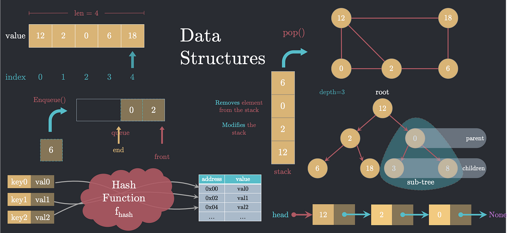

************

*****************

     When deciding which data structure to use for solving a particular problem, it is important to recognize that no single data structure can optimally solve all problems.Thus, the selection of the most appropriate data structure should depend on:

1. The nature of the problem to be solved.
2. The operations to be performed and their frequency. For instance, one should choose a data structure that can efficiently support the required operations, such as adding, removing, searching, and sorting elements. Additionally, it is essential to ensure that recursive functions have base cases that terminate the recursion and avoid an infinite recursive call stack.
*******

**Data structures** refer to specialized formats used for organizing, processing, retrieving, and storing data to meet a specific purpose. They provide a set of operations to work with data, and there are several types of data structures, including arrays, linked lists, trees, graphs, and hash tables. A compound data structure is one that contains multiple values or pieces of data. Big O notation is a technique used to describe the time complexity of an algorithm or how the runtime of an algorithm grows as the size of the input increases.
Examples of commonly used data structures include **nodes, linked lists, arrays, hash tables, double (stack + queue), graphs, and trees**. 

    Recursive functions, which are functions that call themselves one or more times, can be divided into smaller subproblems and solved recursively.

#  Recursive Case
The recursive case is the part of the function that **calls itself** to solve a smaller subproblem, while the **base case** is the *stopping condition* for the recursive function. 
*******
# Big O Notation
The **big O notation** is often used to ***analyze the performance of algorithms*** by describing the time complexity of the algorithm in terms of its efficiency.
To avoid an infinite recursive call stack, we can do the following:

 1.     Ensure that the recursive function has a base case that
 2.     Make sure that the recursive function is making progress towards the base case. This means that the arguments passed to the recursive function should be getting closer to the base case with each recursive call. 
 3.	    Use tail recursion if possible: This means that the recursive call is the last statement in the function, so that the compiler can optimize the function to avoid using additional stack space for each recursive call. 
 4.     Increase the stack size if needed: In some cases, the default stack size may not be enough to handle a particularly deep recursion. In these cases, the stack size can be increased to avoid a stack overflow error.
**********
# Things I want to learn: