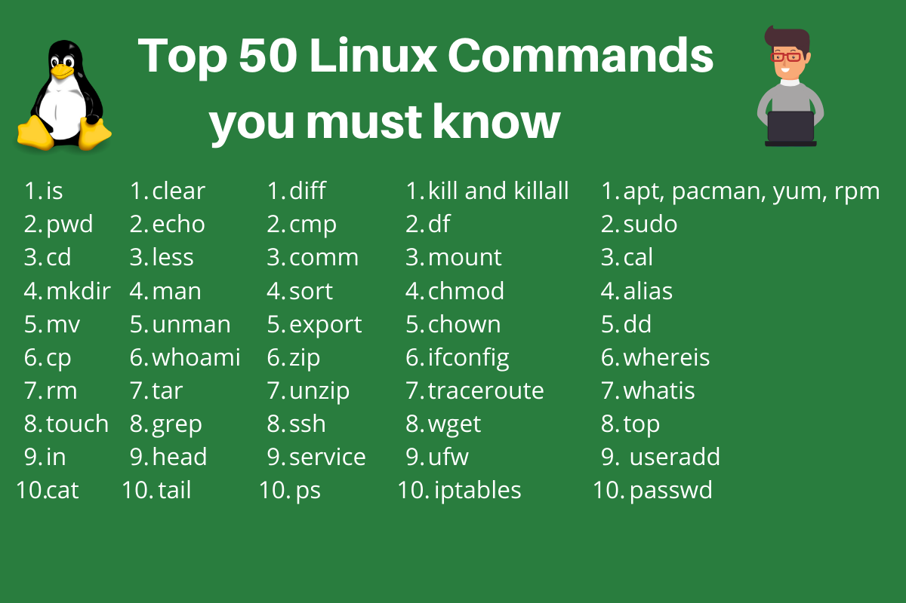

***
# The Command Line:
The command line is a text-based interface used to interact with a computer's operating system.
 It provides more flexibility and power than a graphical user interface (GUI).
***********
To access the command line on a Linux or Mac OS, you can open the Terminal application.
On Windows, you can use the Command Prompt or PowerShell.
Commands are typed into the terminal and executed by pressing enter.
Basic Navigation:
1. The Linux file system is organized hierarchically, with the root directory at the top.
2. Directories are separated by forward slashes (/).
3. The pwd command shows the current working directory.
4. The ls command lists the contents of the current directory.
5. The cd command is used to change directories.
6. cd .. moves up one level in the directory tree.
7. The tab key can be used for auto-completion.
**More About Files:**
1. The ls -l command shows the permissions for files and directories.
2. Directories have a special permission bit that allows users to list their contents.
3.  Hidden files in Linux start with a dot (.) and can be shown with the ls -a command.
4. File and directory names are case-sensitive.
Manual Pages:
1. Manual pages (man pages) provide documentation for Linux commands.
2. They can be accessed with the man command followed by the name of the command you want to learn about.
3. man is used to access the manual pages for a command.
4. Manual pages can be searched using the / key followed by the search term.
5.  Manual pages can be exited by typing q

# File Manipulation:
1. Files can be created with the touch command and directories with the mkdir command.
2. Files can be copied with the cp command and directories with the cp -r command.
3. Files and directories can be moved or renamed with the mv command.
4. Files and directories can be removed with the rm command (use with caution!).
5. The grep command can be used to search for text within files.

# Things I will learn Later:
