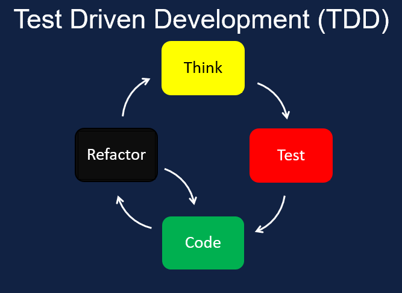

# In Tests We Trust - TDD with Python

### Test-Driven Development (TDD) is a software development methodology that emphasizes writing automated tests for every feature or functionality before writing the actual code. The main principles of TDD are as follows:

1. **Red-Green-Refactor Cycle**: In TDD, the first step is to **write a test that fails. This is the "Red" phase**. Once the test is written, the **developer writes the minimum amount of code necessary to pass the test, called the "Green" phase**. Finally, the code is refactored to make it more efficient and maintainable.

2. **Test First:** The tests are written before the actual code. This helps the developer to think about the functionality and the requirements of the code before writing it.

3. **Continuous Integration:** TDD is typically used in conjunction with continuous integration. Every time a change is made to the codebase, all the tests are run to ensure that the change has not broken any existing functionality.

4. **Small Iterations:** TDD emphasizes small, incremental changes to the codebase. This makes it easier to identify and fix problems as they arise.
*****

******
**The key benefit of TDD is that:**
-  Helps to improve the overall quality of the code. By writing tests before the code, the developer can catch and fix errors early on in the development process, before they become more difficult and expensive to fix. 
-  Continuous integration process ensures that the code is always working as intended, even as new features are added or changes are made to the codebase.
-  The emphasis on small iterations and refactoring helps to ensure that the code remains **efficient, maintainable, and scalable** over time.
****
# ## Things I want to know more about