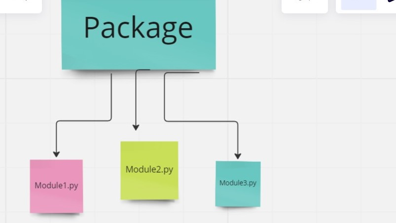

# Python Modules and Packages:

In Python, **a module** is a **file containing Python definitions and statements**.

 **The package is a collection of modules that are organized in a directory hierarchy**.

look at the below picture 
now you can find the difference between module and pakage

*******
key points of positive for modularity:
1. **Simplicity**
2. **Maintainability**
3. **Reuesability**
4. **Scoping**

****
To create a module, you simply create **a .py file** and put your Python code in it. You can then **import the module in other Python programs using the import statement**. For example, if you have a module named **my_module.py**, you can import it in another program like this:

import my_module
----

To use **functions or variables defined in the module**, you need to prefix them with the module name

my_module.my_function()
my_module.my_variable
----
To create a package, you need to create a directory with an __init__.py file in it. This file can be empty or can contain Python code to initialize the package. You can then create modules inside the package directory and use it in other Python programs. For example:

from my_module import my_function, my_variable
-----

the way handle any mistake when you import an module in any package.
insert
_init_.py
and in directory type
_init_.py
****
**To search for any module you can use:**
**the name of module .path**
----
## Things I want to know more about

