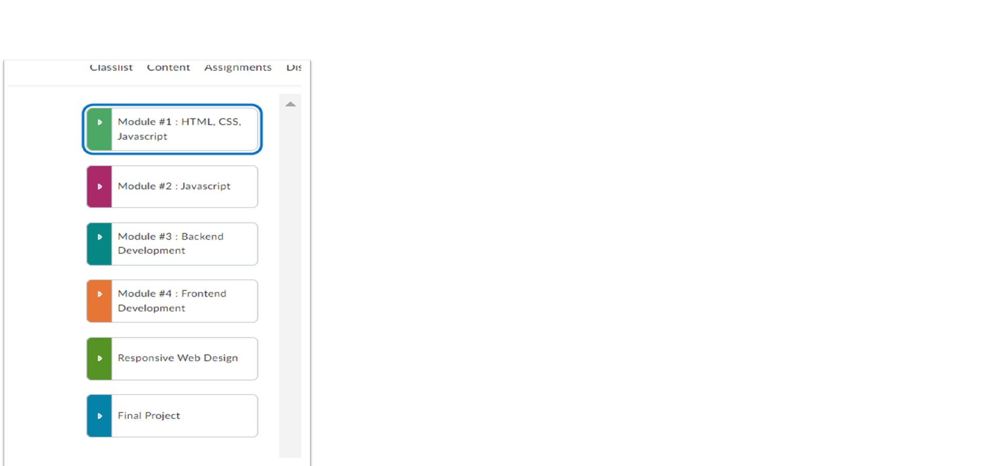

 # reading-notes

This a reading-notes main page is a collection of notes and summaries for the various courses I am taking now, then you can see another courses that about what I taked, It serves as a helpful resource for me to review key concepts and ideas from each course, and may also be useful for others who are interested in the topics covered.
****
|Class |Reading-Notes|
|---------|--------|
|Class 0|[Intro to programming & python](./Class-00/Indixing.md) |
|Intro to Data -Structure|[Data -Structure](Data-Structure.md) |
|Class 1|[testing](./Class-01/Indixing.md)|
|Class 2|[FIO](./Class-02//Indexing.md)|
|Class 3|[oop](./Class-03/Indixing.md)||
|Class 4|[Data-Structure](./Class-04/Datastructure.md )|
|Class 5|[readingnotes](./Class-05/readme.md)|
|Class 6|[Variables](./Class-06/notes.md)|
|Class 7|[Stacks and Queues](./Class-07/datastructure.md)|
|Class 8|[TenThousand](./Class-08/Tenthousand.md)|
|Class 9|[__method__](./Class-09/reading9.md)|
|Class 10|[DataAnalysis](./Class-10/DataAnalysis.md)|
|Class 11|[Panadas](./Class-11/Pandas.md)|
|Class 12|[Linear regression](./Class-12/Linear_regClas.md)|
|Class 13|[Data Visualization](./Class-13/DataVisualization.md)|
|Class 14|[Tree](./Class-14/Tree.md)|
|Class 15|[serverless](./Class-15/serverless.md)|
|Class 16|[Scraping Static and Dynamic Websites](./Class-16/web.md)|
|Class 26|[Django](./Class-26/Django.md)|
|Class 27|[Django](./Class-27/Django2.md)|
|Class 28|[Django Models and Formes](./Class-28/forms.md)|
|Class 29|[Django Customer User](./Class-29/djcuser.md)|
|Class 30|[Hash Table](./Class-30/hash.md)|
|Class 31|[Django REST Framework & Docker ](./Class-31/Docker.md)|
|Class 32|[Permissions & Postgresql ](./Class-32/DRF.md)|
|Class 33|[Authentication & Production Server ](./Class-33/json.md)|
|Class 34|[ API Deployment ](./Class-34/APIDeployment.md)|
|Class 35|[Mock_Interview](./Class-35/MockInterview.md)|
|Class 36|[Graph](./Class-36/Graph.md)|
|Class 37|[Dajngo](./Class-37/django.md)|
|Class 38|[react](./Class-38/react.md)|
|Class 39|[react](./Class-39/react.md)|
|Class 41|[react](./Class-41/Nextreact.md)|

***********
## Pre-Courses 
-------------------------
Here are the courses I taked:

1. **HTML, CSS, JavaScript.**

2. **JavaScript.**
3. **Backend Development.**
4. **Frontend  Development.**
5. **Responsive Web -Design.**
6. **Finall-Project.**
*********

*****************

## Markdown Features Used
Here are the Markdown features I've used to structure this page:

- Level 1 and level 2 headings
- Paragraphs
- Lists(***ol && li** types of Lists)
- **Bold** and *italic* text formatting.
-------
- Horizontal rules.
*******
- Insert an Modules-image.