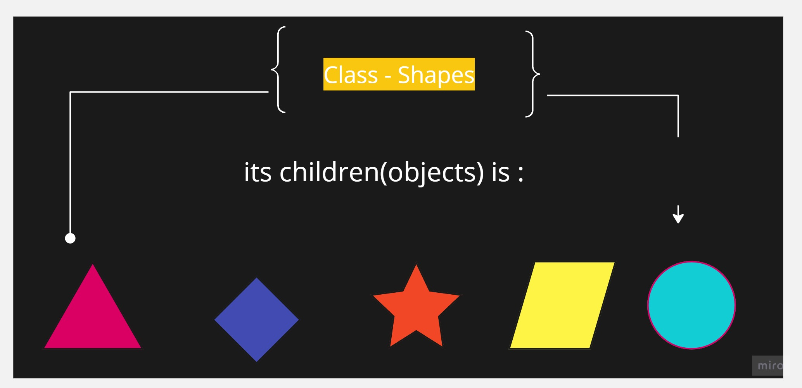

# Elemantry concepts in oop:
## Class && object 
********

In Python, a class is a **blueprint or a template ***for What ?*** for  creating objects** while an object is an **instance** of a class. 
----
******
## The key differences between a class and an object:

## **1. Definition:**

-  **Class:** A class is a user-defined data type that defines the **properties (attributes)** and **behaviors (methods)** that **objects of the class should have.**

- **Object:** An object is an **instance of a class.** It represents a specific occurrence of the class and has its own **unique set of attributes and values**.

## **2.  Usage:**

- **Class:** A class serves as a **blueprint** that can be used to **create multiple objects** with **similar characteristics and behaviors**.
- **Object:** An object is an **individual instance** created **from a class**. It can be used to **access and manipulate the attributes and methods** defined in the class.

## **3. Relationship:**

- **Class:** A class can exist **without any objects**. It defines the structure and behavior that objects of the class should have.

- **Object:** An object **cannot exist without a class.** It is created based on the structure and behavior defined by the class.

## **4. Creation:**

- **Class:** A class is created using the ***class keyword followed by a class name and a code block*** that contains the class's attributes and methods.

- **Object:** An object is created by ***calling the class as if it were a function***. This process is known as **instantiation**.

## **5. Multiple Instances:**

- **Class:** A class can be used to **create multiple instances (objects)** ***with different*** **attribute values**.
- **Object:** Each object is **a separate instance** with its **own set of attribute values**.

## Things I want to know more about